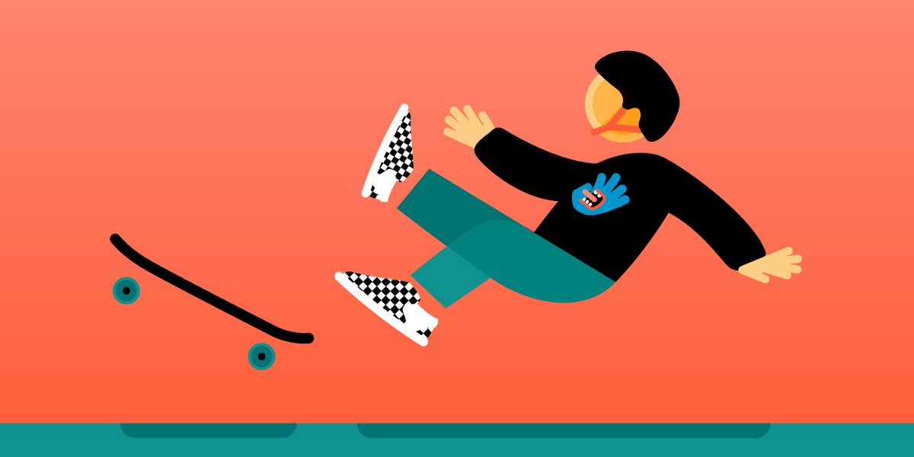
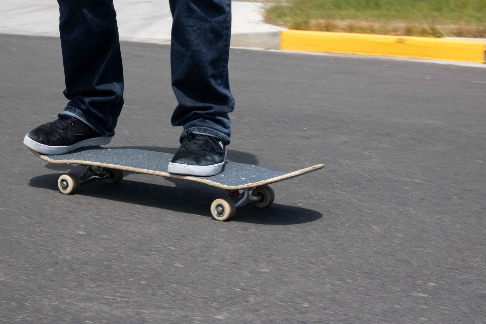
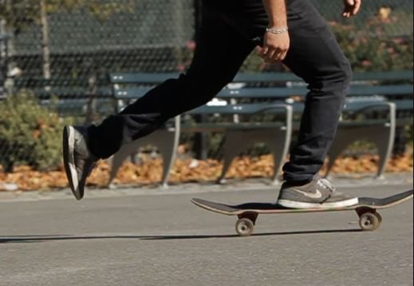
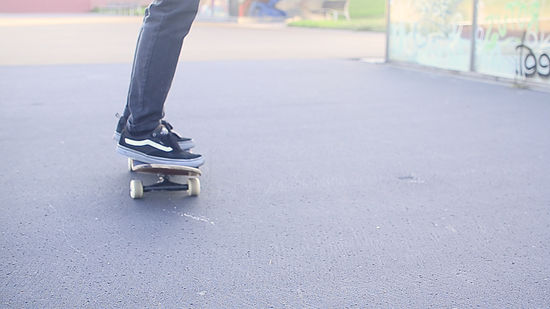

# How to Skateboard
---

Skateboarding is when a person rides standing balanced on a small board mounted on wheels. Skateboarding gives the user entertainment and transportation device. It can also help build strength and balance for the person.

# Warning
---

 #### Falling off the skateboard can cause self harm.

 
# Items
-----
- Skateboard
- Helmet
- Knee and elbow pads 

# Steps
---
#### 1. Wear the helmet with the knee and elbow pads

#### 2. Find a place to skate
- sidewalk, outside the garage, or anywhere with solid ground
- No holes or cracks on the ground that can cause crashing

#### 3. Place the skateboard on the ground

#### 4. Try and get used to balancing on the board with both feet

#### 5. Use your dominant foot and gently push off the ground and place back on with both foot
- If using dominant foot to push off the ground feels uncomfortable then you can use your other foot instead, it takes time to get used it

#### 6. Repeat step 5 until you feel comfortable 

#### 7. Now practice pushing off the ground when the board starts to slow down

#### 8. Use your ankles and weight on the sides of the board to turn 

#### 9. Place your foot down when the skateboard slows down to brake

-Now you got the basics of skateboarding
